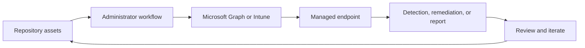

<!-- unified-readme:start -->
<div align="center">

# Intune App Creator

**PowerShell tool for automated creation, packaging, and deployment preparation of Intune Win32 apps.**

Package. Prepare. Deploy.

[](https://github.com/JayRHa/IntuneAppCreator/stargazers)
[](https://github.com/JayRHa/IntuneAppCreator/network/members)
[](https://github.com/JayRHa/IntuneAppCreator/issues)
[](https://github.com/JayRHa/IntuneAppCreator/graphs/contributors)

<p>
  <a href="https://jannikreinhard.com/">Blog</a> ·
  <a href="https://www.linkedin.com/in/jannik-r/">LinkedIn</a> ·
  <a href="https://x.com/jannik_reinhard">X</a>
</p>

---

`Endpoint Management` | `PowerShell` | `Public` | `Maintained`

</div>

## What is this?

Intune App Creator supports Microsoft Intune and endpoint management workflows such as automation, troubleshooting, remediation, deployment, or reporting.

## Project Context

- Use it when Intune work should be scripted, packaged, synchronized, or made easier to repeat.
- Most workflows start from repository assets, then move through Microsoft Graph, Intune, or device-side execution.
- This repository is maintained as a practical project and reference asset.

## How It Works

The repository stores scripts or tooling, administrators configure or run them, Intune and Microsoft Graph apply the work, and endpoint results feed back into reports or follow-up actions.



## Quick Start

1. Review the project context and workflow below.
2. Clone the repository:

   ```bash
   git clone https://github.com/JayRHa/IntuneAppCreator.git
   ```

3. Continue with the setup, usage, or workflow sections below.

---
<!-- unified-readme:end -->

# IntuneAppCreator
[Blog Post](https://jannikreinhard.com/2022/08/01/introduction-of-the-chocolatey-intune-app-creator/)
<p align="left">
  <a href="https://x.com/jannik_reinhard">
    
  </a>
    <a href="https://github.com/JayRHa">
    
  </a>
</p>


Anyone who has worked with Intune and deployed an app knows that this is a bit of work. You have to download the sources, create the IntuneWin file, create the app in Intune. To simplify this I have created the Intune App Creator. With this application you can search within the >9,000 Chocolatey and automatically add this app to your Intune app portfolio with just one click.


